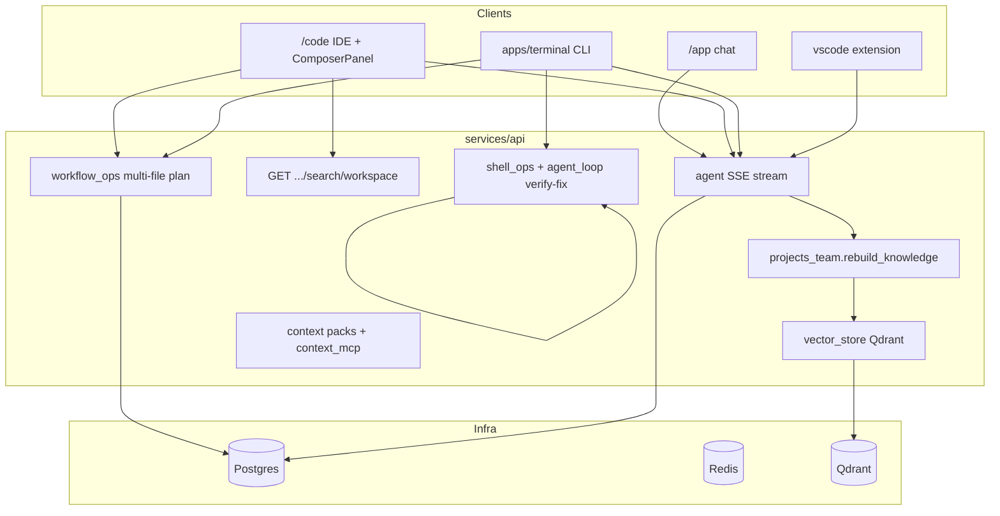

# CodeForge → Cursor Parity Blueprint

> **Goal:** Deeply integrate an AI agent development workflow that matches Cursor’s core primitives: repository-wide context (`@`-mentions), multi-file Composer, terminal self-verification, and inline edit.

This document evaluates what CodeForge already ships, what is missing, and a phased plan to close the gap. Configuration lives in [`.codeforge/agent-workflow.yaml`](../.codeforge/agent-workflow.yaml).

---

## Executive summary

| Capability | Cursor reference | CodeForge today | Gap |
|------------|------------------|-----------------|-----|
| **Codebase indexing & @-mentions** | `@workspace`, `@file`, `@folder` | Qdrant knowledge rebuild, symbol search, `@` picker in `/code` Composer | No unified mention resolver; indexing is session/project-scoped; `/app` chat lacks full picker |
| **Multi-file Composer** | Plan → apply diffs across files | `workflow_ops.py` plan/execute/rollback; terminal `/plan`; `ComposerPanel` on `/code` | Web `/app` not wired; sequential per-file runs; no global “Composer” entry |
| **Terminal & PTY** | Integrated terminal, agent runs tests | `shell_ops.py` sandbox + `run_verify_fix_loop`; terminal CLI `/run` | Subprocess only (no PTY/WebSocket); strict allowlist; no web xterm session |
| **Inline edit** | Ctrl+K on selection | `use-code-workspace.js` + `CodeEditor` context menu; VS Code extension | Only on `/code` IDE route; selection context not injected as structured block |

**Recommended first step:** Enable and wire the **mention + context resolver** (Phase 1). Indexing primitives already exist; the highest leverage work is parsing `@file` / `@workspace` in chat and resolving them through existing search/knowledge APIs before each agent turn.

---

## Architecture (current)



---

## Feature 1: Codebase indexing & @-mentions

### What exists

| Component | Location | Role |
|-----------|----------|------|
| Knowledge rebuild | `services/api/app/projects_team.py` → `rebuild_knowledge()` | Chunks repo files, embeds into Qdrant |
| Vector store | `services/api/app/vector_store.py` | Qdrant client; skips when `QDRANT_URL` empty |
| Workspace search | `GET /api/v1/sessions/{id}/search/workspace` | Symbol + path search |
| Knowledge in stream | `agent.py` / team injection | RAG chunks appended to agent context |
| UI mention picker | `CodebaseSearchPanel.jsx`, `ComposerPanel.jsx` | `@` opens symbols / `@codebase` search |
| Context packs | `POST /api/v1/context/packs` | Reusable context bundles |

### Gaps vs Cursor

1. **No mention grammar** — `@path/to/file.ts` in prompt text is not parsed server-side.
2. **No `@workspace`** — no single resolver that pulls top-k chunks for the whole indexed tree.
3. **Indexing is manual/triggered** — no watch-on-save or `stack:up` auto-rebuild hook.
4. **`/app` chat** — main product chat does not expose `CodebaseSearchPanel` or `@` trigger.

### Phase 1 deliverables

1. **`mention_resolver` service** (API)
   - Parse prompt for `@workspace`, `@folder:path`, `@file:path`, `@symbols:query`.
   - Resolve via existing `search/workspace` + Qdrant knowledge query.
   - Return structured `ContextAttachment[]` (path, line range, snippet, token budget).

2. **Pre-stream hook** in agent message handler
   - Call resolver before `build_agent_run`.
   - Attach resolved context to system/context block (respect `max_context_tokens` from config).

3. **Web: unified mention UX**
   - Port `@` picker from `ComposerPanel` to `/app` chat input.
   - Autocomplete file paths from `GET .../files` tree.

4. **Indexing automation**
   - On session bind to project: enqueue `rebuild_knowledge` if stale (mtime / git HEAD).
   - CLI: `npm run index:workspace` → hits rebuild endpoint.

### API sketch (new)

```
POST /api/v1/sessions/{session_id}/context/resolve-mentions
Body: { "text": "refactor @file:apps/web/lib/api.js and @workspace auth" }
Response: { "attachments": [...], "token_estimate": 4200 }
```

---

## Feature 2: Multi-file Composer

### What exists

| Component | Location | Role |
|-----------|----------|------|
| Plan creation | `workflow_ops.create_multi_file_plan()` | LLM proposes file targets + steps |
| Plan execution | `workflow_ops.execute_multi_file_plan()` | Applies proposals per file |
| Rollback | `rollback_multi_file_plan()` | Restores snapshot |
| HTTP routes | `POST .../workflows/plan`, `.../execute`, `.../rollback` | REST surface |
| Terminal | `apps/terminal` `/plan` command | CLI composer |
| Web IDE | `ComposerPanel.jsx` modes Agent / Ask / Plan | UI on `/code` only |

### Gaps vs Cursor

1. **Composer not on `/app`** — primary chat surface is single-turn proposal flow.
2. **No parallel diff application** — files processed sequentially.
3. **Plan mode** does not auto-chain execute + verify.
4. **No architectural “plan document”** persisted in UI (markdown plan card).

### Phase 2 deliverables

1. **Composer orchestrator** (reads `.codeforge/agent-workflow.yaml`)
   - Modes: `ask` | `plan` | `agent` | `composer`.
   - `composer` = plan → user approve → execute → `run_verify_fix_loop`.

2. **Wire `/app` chat** to `POST .../workflows/plan` when mode is `plan` or `composer`.

3. **`ComposerPlanCard` component** — shows file list, diff previews, Approve / Execute / Rollback.

4. **Optional:** batch apply endpoint for atomic multi-file patch.

---

## Feature 3: Terminal & PTY integration

### What exists

| Component | Location | Role |
|-----------|----------|------|
| Shell sandbox | `services/api/app/shell_ops.py` | Subprocess, cwd-locked, allowlist |
| Verify-fix loop | `services/api/app/agent_loop.py` | Run tests → propose fixes |
| Stream endpoint | Shell SSE in main API | Terminal `/run` consumes |
| RTK compression | `rtk_service.py` | Shrinks verbose command output |

### Gaps vs Cursor

1. **No PTY** — no interactive `npm run dev`, no TTY colors/cursor.
2. **Strict allowlist** — many dev commands blocked (`docker`, `node` direct, etc.).
3. **No web terminal** — xterm references exist but no live session service.
4. **Agent does not auto-run verify** after every apply unless explicitly in loop.

### Phase 3 deliverables

1. **Policy tiers** in `agent-workflow.yaml`: `readonly` | `verify` | `dev` | `full`.
2. **Expand allowlist** for verify tier: `npm test`, `pytest`, `cargo test`, `go test`, etc.
3. **PTY service** (optional container sidecar or `node-pty` in API worker):
   - `WS /api/v1/sessions/{id}/terminal` for web IDE.
4. **Post-apply hook:** if `composer.auto_verify` true, run configured `verify_command` from config.

---

## Feature 4: Inline edit simulation

### What exists

| Component | Location | Role |
|-----------|----------|------|
| Ctrl+K / menu | `MenuBar.jsx`, `CodeEditor.jsx` | Opens inline edit overlay |
| Handler | `use-code-workspace.js` → `handleSubmitInlineEdit()` | Sends user message + streams proposal |
| Preview | `SplitEditorLayout.jsx` inline edit card | Shows patch preview |
| VS Code | extension explain/refactor commands | Editor selection → API |

### Gaps vs Cursor

1. **Unstructured prompt** — selection sent as plain text, not fenced code block with line numbers.
2. **Not global** — only `/code` route; `/app` has no Monaco selection bridge.
3. **No “quick apply”** — always goes through full proposal review.

### Phase 4 deliverables

1. **Structured inline context** in API:
   ```json
   {
     "type": "inline_edit",
     "path": "apps/web/lib/api.js",
     "start_line": 10,
     "end_line": 25,
     "selection": "...",
     "instruction": "add error handling"
   }
   ```
2. **`inline_edit.fast_apply`** mode — auto-apply when diff &lt; N lines and tests pass.
3. **Global shortcut** via desktop (Tauri) and VS Code extension parity doc.

---

## Configuration

All toggles and limits: [`.codeforge/agent-workflow.yaml`](../.codeforge/agent-workflow.yaml).

The API should load this file from the session’s `project_path` (same pattern as `.codeforge/skills/`). Until the loader is implemented, treat the YAML as the contract for Phase 1–4 work.

---

## Implementation phases

| Phase | Focus | Effort | Depends on |
|-------|-------|--------|------------|
| **1** | Mention resolver + `/app` @ picker + index script | 3–5 days | Qdrant up (`stack:up`) |
| **2** | Composer orchestrator + `/app` plan UI | 4–6 days | Phase 1 |
| **3** | Terminal policy + verify hooks (+ PTY optional) | 5–8 days | Phase 2 |
| **4** | Inline edit structured API + fast apply | 2–3 days | Phase 1 |

---

## First step (do this now)

1. **Copy config:** Ensure `.codeforge/agent-workflow.yaml` exists in your repo (committed).
2. **Index the workspace:**
   ```bash
   npm run stack:up          # Qdrant + API healthy
   # In UI: Team → rebuild knowledge for your project session
   # Or after Phase 1 CLI lands: npm run index:workspace
   ```
3. **Implement Phase 1.1:** `mention_resolver.py` + `POST .../context/resolve-mentions` + unit tests.
4. **Smoke test on `/code`:** Type `@` in Composer, confirm symbols/knowledge still work; then wire same picker to `/app`.

---

## Key files reference

| Area | Files |
|------|-------|
| Indexing | `services/api/app/projects_team.py`, `vector_store.py` |
| Search | `services/api/app/main.py` (workspace search route) |
| Agent | `services/api/app/agent.py`, `agent_loop.py` |
| Multi-file | `services/api/app/workflow_ops.py` |
| Shell | `services/api/app/shell_ops.py` |
| Web IDE | `apps/web/lib/use-code-workspace.js`, `components/ide/ComposerPanel.jsx` |
| Web chat | `apps/web/app/app/page.jsx`, `components/chat/*` |
| Terminal | `apps/terminal/src/cli.jsx` |
| Config | `.codeforge/agent-workflow.yaml` |

---

## Success criteria

- [ ] `@file:path` and `@workspace` in any chat surface resolve to context before agent reply.
- [ ] Composer mode plans and applies multi-file changes with rollback.
- [ ] Agent runs `npm test` / `pytest` after apply when `auto_verify` is enabled.
- [ ] Ctrl+K on `/code` sends structured selection and shows inline diff preview.
