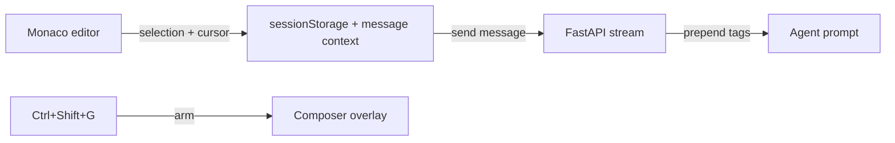

# Magic Pointer

Cursor-aware, gesture-driven AI context inspired by Google DeepMind's "Magic Pointer" concept.

## First step (done)

1. **Rules** — `.cursor/rules/magic-pointer.mdc` (deictic language + entity actions)
2. **Config** — `.codeforge/magic-pointer.yaml` (bindings, triggers, entity patterns)
3. **Tagged payload** — `[ACTIVE_CURSOR_CONTEXT]...[/ACTIVE_CURSOR_CONTEXT]` injected by API

## How it works

### Show and Tell (selection binding)

On `/code`, every selection/cursor change updates hidden state (`codeforge_magic_pointer` in sessionStorage). On send, `buildMessageContext()` includes:

- `current_file`, `line_number`
- `selection_text` + line range
- `cursor_line_text` (when no selection)
- `surrounding_context` (±5 lines with `>` markers)

### Deictic language

The API prepends deictic instructions so **"optimize this"** resolves to `Selected Text` without pasting.

### Triggers

| Trigger | Action |
|---------|--------|
| **Ctrl+Shift+G** | Arm Magic Pointer, open composer |
| **/pointer** | Print current `[ACTIVE_CURSOR_CONTEXT]` block |
| **Ctrl+K** | Inline edit (existing) |

### Entity detection

Server-side heuristics in `services/api/app/magic_pointer.py` detect API routes, `/api/` paths, npm module errors, pytest failures, imports, and terminal errors — with suggested actions in the context block.

## Files

| File | Role |
|------|------|
| `.cursor/rules/magic-pointer.mdc` | Cursor agent rules |
| `.codeforge/magic-pointer.yaml` | Project config |
| `packages/shared/src/magic-pointer.js` | Web formatter + sessionStorage |
| `services/api/app/magic_pointer.py` | API formatter + entities |
| `apps/web/components/code/CodeEditor.jsx` | Ctrl+Shift+G keybinding |

## Status (phases 2–4 shipped)

- **Hover binding** — Monaco `onMouseMove` debounced; hover token feeds entity detection
- **`/app` chat** — reads `sessionStorage` pointer state from `/code`; entity chips above composer
- **VS Code** — `getMagicPointerMessageContext()` sends full API context on chat turns
- **Action chips** — `MagicPointerChips` in `/code` Composer and `/app` chat

## Optional future work

- Debounced hover-to-bind without mouse movement stop
- Entity chips as one-click shell actions (e.g. run `npm install`)
