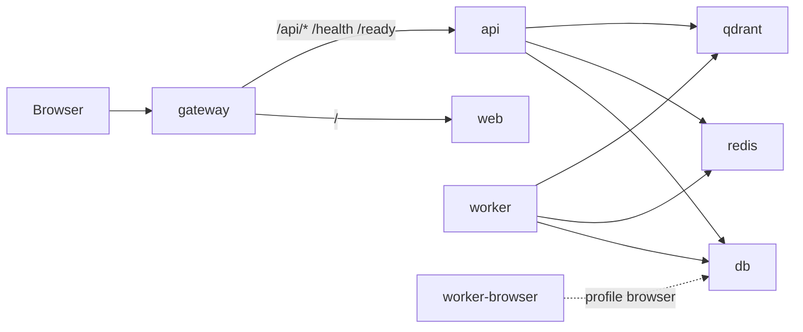

# CodeForge microservices

CodeForge runs as a **small set of containers**, not one container per Next.js page. All UI routes (`/`, `/app`, `/code`, `/roadmap`, etc.) live in the **web** service; the API and worker are separate services.

## Service map

| Service | Image / build | Port (host) | Role |
|---------|---------------|-------------|------|
| **gateway** | `infra/gateway` (`nginx:1.27.4-alpine`) | **8080** | Single entry: UI + API proxy |
| **web** | `apps/web/Dockerfile` (Next.js standalone) | 3000 | Next.js UI (marketing + product) |
| **api** | `services/api/Dockerfile` (`python:3.13-slim-bookworm`) | 8000 | FastAPI platform API |
| **worker** | `services/api/Dockerfile.worker` (slim, no browser) | — | Celery jobs (httpx scrape fallback) |
| **worker-browser** | `services/api/Dockerfile.worker-browser` (optional) | — | Celery + Playwright/Chromium |
| **db** | `postgres:16.8-alpine` | — | Postgres |
| **redis** | `redis:7.4-alpine` | — | Sessions + Celery broker |
| **qdrant** | `qdrant/qdrant:v1.13.1` | 6333 (localhost) | Vector store |



## Image size targets (approximate)

| Image | Target | Verified (local build) |
|-------|--------|------------------------|
| gateway | ~25–75 MB | 73 MB |
| web | 120–250 MB | **229 MB** |
| api | 200–350 MB* | 1.12 GB |
| worker (slim) | 250–400 MB* | 1.1 GB |
| worker-browser | ~1.2 GB | optional (`--profile browser`) |
| postgres / redis | Alpine (pinned) | pull-only |

\*API and worker remain larger than slim targets because `litellm`, `scrapegraphai`, and related ML/scrape dependencies dominate the image. Playwright/Chromium were removed from the default worker (largest win: ~260 MB browsers + GTK stack). The **web** image dropped from ~800 MB–1 GB+ (full monorepo copy) to **229 MB** via Next.js standalone.

Compare sizes after a build:

```bash
docker compose -f docker-compose.dev.yml build
npm run docker:sizes
```

## Compose files

| File | Use |
|------|-----|
| [`docker-compose.prod.yml`](docker-compose.prod.yml) | Base service definitions (infra + api + worker + web) |
| [`docker-compose.microservices.yml`](docker-compose.microservices.yml) | Adds **gateway**, dev env, web healthchecks |
| [`docker-compose.dev.yml`](docker-compose.dev.yml) | Local dev: includes microservices + exposes API :8000 |

## Commands

**Recommended on a laptop (fastest):** API + infra in Docker, Next.js hot-reload on the host:

```bash
npm run dev:local
# open http://localhost:3000
```

Do **not** use `--profile browser` unless you need Playwright/Chromium — it builds a ~1.2 GB image and often fails when Docker Desktop is low on disk.

```bash
# Slim stack (default worker — no Playwright/Chromium)
npm run stack:up
# or
docker compose -f docker-compose.dev.yml up -d --build

# Full stack + browser worker (Playwright automation — large image; skip unless you need Chromium)
# If Docker reports "input/output error", restart Docker Desktop first.
docker compose -f docker-compose.dev.yml --profile browser up -d --build

# Open:
#   http://localhost:8080  — gateway (UI + API same origin)
#   http://localhost:3000  — web direct
#   http://localhost:8000  — API direct

# Backend only + hot-reload web on host
npm run stack:up:backend
npm run dev:web:fresh

# Production-style microservices file only
npm run stack:up:ms

# Image size report
npm run docker:sizes
```

## Environment

With the **gateway** on port 8080, set in `.env`:

```env
CODEFORGE_WEB_BASE_URL=http://localhost:8080
CODEFORGE_CORS_ORIGINS=http://localhost:8080,http://localhost:3000
NEXT_PUBLIC_API_BASE=http://localhost:8080
```

The web image is built with `NEXT_PUBLIC_API_BASE` pointing at the gateway so browser calls use `/api/v1/...` on the same origin.

**Gateway routing:** `/api/auth/*` and `/api/proxy/*` go to the **web** container (Next.js BFF). `/api/v1/*` goes to **FastAPI**. Do not route all `/api/` to the API — dev-login and session cookies break.

Default **worker** sets `CODEFORGE_DISABLE_PLAYWRIGHT=true`; cowork/scrape paths use httpx when Playwright is unavailable. Enable the **browser** profile when you need headless Chromium automation.

## What is not containerized

- **desktop** (Tauri), **terminal** (CLI), **vscode** (extension) — client apps that talk to the API
- Individual Next.js **pages** — routes inside the **web** service (standard for SSR apps)

## Healthchecks

- API: `GET /ready` (postgres + redis)
- Web: `GET /login` inside container
- Gateway: `GET /health` proxied to API

## Troubleshooting (local laptop)

| Error | Cause | Fix |
|-------|--------|-----|
| `input/output error` during `worker-browser` build | Docker Desktop disk/store corruption; often after `--profile browser` | **Restart Docker Desktop** (Settings → Troubleshoot → Restart). Use `npm run dev:local` instead — no browser worker. |
| `read-only file system` on `docker compose down` | Same — Docker engine unhealthy | Restart Docker Desktop; if it persists, Docker → Clean / Purge data (removes images). |
| `500 Internal Server Error` from `dockerDesktopLinuxEngine` | Docker daemon not running or wedged | Start or restart Docker Desktop; wait until it shows "Running". |
| `POSTGRES_PASSWORD must be set` | Missing root `.env` | Run `node scripts/ensure-docker-env.mjs` (also runs automatically before `stack:up` / `dev:local`). |
| `EADDRINUSE :3000` | Port 3000 in use | `npm run dev:web:fresh` frees the port automatically. |
| `container codeforge-api is unhealthy` | Postgres password in `.env` does not match the existing Docker volume (often after changing `POSTGRES_PASSWORD`) | `docker compose -f docker-compose.dev.yml down -v` then `npm run stack:up` (wipes local DB data). |
| `password authentication failed for user "codeforge"` | Same as above — API cannot connect to Postgres | Reset the volume with `down -v` and ensure `.env` has `POSTGRES_PASSWORD` (run `node scripts/ensure-docker-env.mjs`). |
