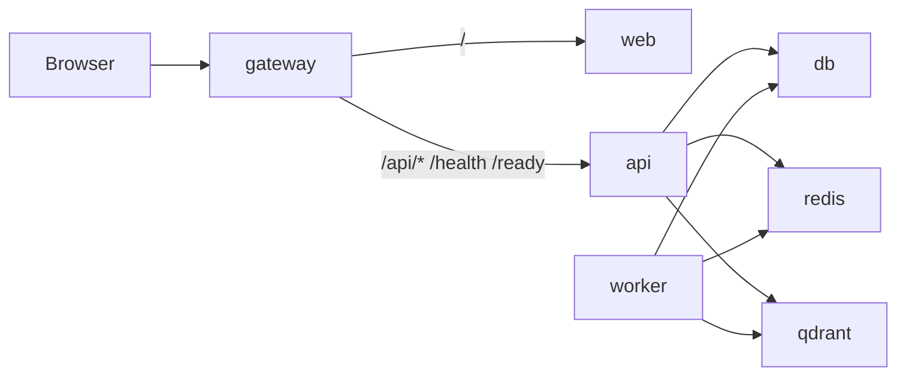

# CodeForge microservices

CodeForge runs as a **small set of containers**, not one container per Next.js page. All UI routes (`/`, `/app`, `/code`, `/roadmap`, etc.) live in the **web** service; the API and worker are separate services.

## Service map

| Service | Image / build | Port (host) | Role |
|---------|---------------|-------------|------|
| **gateway** | `infra/gateway` (nginx) | **8080** | Single entry: UI + API proxy |
| **web** | `apps/web/Dockerfile` | 3000 | Next.js UI (marketing + product) |
| **api** | `services/api/Dockerfile` | 8000 | FastAPI platform API |
| **worker** | `services/api/Dockerfile.worker` | — | Celery jobs (scrape, cowork, etc.) |
| **db** | `postgres:16-alpine` | — | Postgres |
| **redis** | `redis:7-alpine` | — | Sessions + Celery broker |
| **qdrant** | `qdrant/qdrant` | 6333 (localhost) | Vector store |



## Compose files

| File | Use |
|------|-----|
| [`docker-compose.prod.yml`](docker-compose.prod.yml) | Base service definitions (infra + api + worker + web) |
| [`docker-compose.microservices.yml`](docker-compose.microservices.yml) | Adds **gateway**, dev env, web healthchecks |
| [`docker-compose.dev.yml`](docker-compose.dev.yml) | Local dev: includes microservices + exposes API :8000 |

## Commands

```bash
# Full stack in Docker (recommended for microservices validation)
npm run stack:up
# or
docker compose -f docker-compose.dev.yml up -d --build

# Open:
#   http://localhost:8080  — gateway (UI + API same origin)
#   http://localhost:3000  — web direct
#   http://localhost:8000  — API direct

# Backend only + hot-reload web on host
npm run stack:up:backend
npm run dev:web:fresh

# Production-style microservices file only
npm run stack:up:ms
```

## Environment

With the **gateway** on port 8080, set in `.env`:

```env
CODEFORGE_WEB_BASE_URL=http://localhost:8080
CODEFORGE_CORS_ORIGINS=http://localhost:8080,http://localhost:3000
NEXT_PUBLIC_API_BASE=http://localhost:8080
```

The web image is built with `NEXT_PUBLIC_API_BASE` pointing at the gateway so browser calls use `/api/...` on the same origin.

## What is not containerized

- **desktop** (Tauri), **terminal** (CLI), **vscode** (extension) — client apps that talk to the API
- Individual Next.js **pages** — routes inside the **web** service (standard for SSR apps)

## Healthchecks

- API: `GET /ready` (postgres + redis)
- Web: `GET /login` inside container
- Gateway: `GET /health` proxied to API
