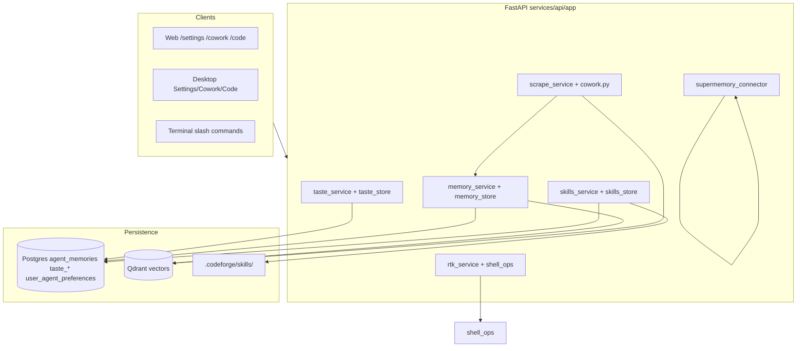

# Phases 7–10 Developer Guide

CodeForge phases 7–10 add **taste rules**, **agent skills**, **RTK shell compression**, **native memory** (with optional Supermemory BYOK), and **ScrapeGraphAI Cowork extraction**. All features share one FastAPI backend and surface on web, desktop, and terminal clients.

Use this guide for architecture, APIs, client entry points, and troubleshooting. Operator setup lives in [DEPLOYMENT_RUNBOOK.md](../DEPLOYMENT_RUNBOOK.md) §14–16. Implementation tickets: [docs/tickets/](tickets/).

## Architecture overview



On each `GET /api/v1/sessions/{id}/stream`, the API composes context in order:

1. Session context packs
2. Team knowledge (RAG)
3. Taste rules + team style guides
4. Native agent memory (vector search)
5. Supermemory (when configured)
6. Agent skills + caveman token-saver instructions

Source: `services/api/app/main.py` (`stream_session` handler).

---

## Phase 7 — Taste rules and agent skills

### Intent

Learn coding preferences from proposal approve/reject/edit feedback and inject them into agent prompts. Skills are markdown playbooks under `.codeforge/skills/`.

### Taste API

| Endpoint | Purpose |
|----------|---------|
| `GET /api/v1/taste/rules` | Active rules + rendered `taste.md` |
| `GET /api/v1/taste/stats` | Approval/rejection metrics per session |
| `GET /api/v1/taste/export` | Export taste pack for team sync |
| `POST /api/v1/taste/import` | Import taste pack |

Proposal decisions (`POST .../proposals/{id}/decision`) accept optional `note` and `edited_content`. Rejects and approve-after-edit events distill heuristic rules into `taste_rules` (max 50 per user).

### Skills API

| Endpoint | Purpose |
|----------|---------|
| `GET /api/v1/skills` | List bundled + project skills |
| `GET /api/v1/skills/{name}` | Load skill body and metadata |
| `GET /api/v1/agent/preferences` | Caveman mode, enabled skills, RTK toggle |
| `PUT /api/v1/agent/preferences` | Update preferences |

Bundled skills: `caveman`, `pr-conventions`, `frontend-design`, `webapp-testing`, `mcp-builder`, `skill-creator`, `doc-coauthoring`. Project skills at `{repo}/.codeforge/skills/<name>/SKILL.md` override bundled names.

Caveman levels: `off`, `lite`, `full`, `ultra`. Injected via `skills_service.compose_agent_instructions` (truncated to ~2500 chars per skill).

### Client entry points

| Surface | Taste | Skills / caveman |
|---------|-------|------------------|
| Web | Settings → Taste; `/taste` slash in chat | Settings → Token Saver & Skills; `/caveman`, `/help` |
| Desktop | Settings → Taste | Settings → Token Saver & Skills; Code chat slash commands |
| Terminal | `/taste stats\|rules\|export` | `/caveman off\|lite\|full\|ultra\|status\|skills` |

### Example — import team taste pack

```bash
curl -X POST http://127.0.0.1:8000/api/v1/taste/import \
  -H "Authorization: Bearer $TOKEN" \
  -H "Content-Type: application/json" \
  -d '{"version":1,"rules":[{"rule_text":"Prefer explicit error handling","weight":3}]}'
```

---

## Phase 8 — RTK, native memory, Supermemory

### RTK shell compression

`shell_ops.py` optionally wraps supported commands through the [rtk](https://github.com/rtk-ai/rtk) binary before output reaches the agent.

**Enable when:**

- `CODEFORGE_RTK_ENABLED=true` (env), or
- User preference `rtk_enabled=true` (`PUT /api/v1/agent/preferences`), or
- Terminal `/rtk on`

**Status:** `GET /api/v1/rtk/status` — reports `binary_available`, `effective_enabled`, and `last_stats`.

Supported commands (read-only): `git`, `pytest`, `npm test`, `cargo test`, `rg`, `python -m pytest`.

**Pitfall:** On Windows hosts running the API outside Docker, install `rtk` manually and add it to `PATH`. Docker images install the Linux binary automatically.

### Native agent memory

Stored in Postgres (`agent_memories`) and indexed in Qdrant (`type=agent_memory`).

| Endpoint | Purpose |
|----------|---------|
| `GET /api/v1/memory` | List memories (optional `project_path`, `scope`) |
| `GET /api/v1/memory/search?q=` | Vector search (native hits) |
| `POST /api/v1/memory/save` | Save memory (`scope`: `personal` or `team`) |
| `GET /api/v1/memory/export` | Export all memories |

**Auto-capture triggers:**

- `/workflows/compact` summary signals
- Approved proposals with architectural notes
- Manual save via API or `/memory save`

### Supermemory BYOK (optional)

```env
SUPERMEMORY_CC_API_KEY=sm_...
SUPERMEMORY_API_URL=https://api.supermemory.ai
```

Per-repo override: copy [`.codeforge/supermemory.json.example`](../.codeforge/supermemory.json.example) to `<project>/.codeforge/supermemory.json`.

| Endpoint | Purpose |
|----------|---------|
| `GET /api/v1/supermemory/status` | Configuration probe |
| `GET /api/v1/supermemory/search?q=` | Search (501 if not configured) |
| `POST /api/v1/supermemory/save` | Save to Supermemory |

`GET /api/v1/memory/search` returns native hits first, then Supermemory when configured.

### Client entry points

| Surface | RTK | Memory |
|---------|-----|--------|
| Web | Settings → Token Saver; `/rtk` in chat | Settings → Memory; `/memory` in chat |
| Desktop | Settings → Token Saver | Settings → Memory |
| Terminal | `/rtk on\|off\|status\|gain` | `/memory search\|save\|list\|export` |

### Example — save a memory

```bash
curl -X POST http://127.0.0.1:8000/api/v1/memory/save \
  -H "Authorization: Bearer $TOKEN" \
  -H "Content-Type: application/json" \
  -d '{"content":"We use Alembic for migrations","scope":"team","project_path":"/workspaces/my-app"}'
```

---

## Phase 9 — ScrapeGraphAI Cowork extraction

Natural-language extraction from URLs or workspace files. Output ingests into project knowledge (Qdrant) and agent memory.

### API

| Endpoint | Purpose |
|----------|---------|
| `POST /api/v1/cowork/scrape` | One-shot scrape (requires `approved: true`) |
| `POST /api/v1/cowork/plans` with `task_type: "scrape"` | Preview + run flow |

**Request fields:**

| Field | Description |
|-------|-------------|
| `scrape_prompt` | What to extract (natural language) |
| `url` | HTTP(S) page |
| `source_path` | Workspace-relative file (HTML, JSON, MD, etc.) |
| `approved` | Must be `true` to execute |
| `ingest_knowledge` | Push to session knowledge (default `true`) |
| `ingest_memory` | Push to agent memory (default `true`) |

### Configuration

```env
OPENAI_API_KEY=...              # required for SmartScraperGraph
CODEFORGE_SCRAPE_ENABLED=true
CODEFORGE_SCRAPE_MODEL=         # optional; defaults to CODEFORGE_SYNTHESIS_MODEL
```

### Guardrails

- Approval required (same as browser tasks)
- URLs must be `http`/`https` only
- `source_path` must stay inside the project workspace
- Scheduled jobs cannot run scrape tasks
- httpx fallback excerpt when ScrapeGraphAI fails on URLs

### Client entry points

| Surface | Entry |
|---------|-------|
| Web | Cowork → Scrape plan type or Quick scrape on Extractions |
| Desktop | Cowork workspace → scrape UI |
| Terminal | `/cowork scrape <url> --prompt "..." --approve` |

---

## Phase 10 — Anthropic skills pack

Curated instruction skills adapted from [anthropics/skills](https://github.com/anthropics/skills) (Apache-2.0). Attribution: [`.codeforge/skills/THIRD_PARTY_NOTICES.md`](../.codeforge/skills/THIRD_PARTY_NOTICES.md).

**Enable skills:**

```http
PUT /api/v1/agent/preferences
{ "enabled_skills": ["frontend-design", "mcp-builder"] }
```

Or use Settings → Skills on web/desktop.

**Author project skills:** create `{repo}/.codeforge/skills/<name>/SKILL.md` with YAML frontmatter (`name`, `description`). See [`.codeforge/skills/README.md`](../.codeforge/skills/README.md).

**Out of scope:** vendoring Anthropic Office skills (`docx`, `pdf`, etc.) or auto-running upstream Python helpers.

---

## Shared client SDK

`packages/shared/src/api.js` exports helpers used by web, desktop, and terminal:

| Helper | API |
|--------|-----|
| `getTasteRules`, `getTasteStats`, `exportTaste`, `importTaste` | Taste |
| `listSkills`, `getAgentPreferences`, `updateAgentPreferences` | Skills |
| `getRtkStatus` | RTK |
| `listMemories`, `searchMemory`, `saveMemory`, `exportMemory` | Memory |
| `getSupermemoryStatus`, `searchSupermemory`, `saveSupermemory` | Supermemory |
| `scrapeCoworkData` | Cowork scrape |

Import from `@codeforge/shared` in workspace clients.

---

## Testing

```bash
cd services/api
source .venv/bin/activate   # or .venv\Scripts\activate on Windows
pytest tests/test_taste.py tests/test_memory.py tests/test_rtk.py tests/test_skills.py tests/test_scrape.py -q
```

`tests/conftest.py` forces SQLite and in-memory vectors per test so local `.env.local` does not hit remote Postgres/Qdrant.

---

## Troubleshooting

| Symptom | Likely cause | Fix |
|---------|--------------|-----|
| `rtk/status` shows `binary_available: false` | RTK not on PATH | Install rtk or use Docker API image; set `CODEFORGE_RTK_BINARY` |
| RTK enabled but no compression | Command not in allowlist | Only read-only git/test/rg commands are wrapped |
| Memory search returns empty | Qdrant down or no memories | Start Qdrant (`QDRANT_URL`); save via `/memory save` or API |
| Supermemory 501 | No API key | Set `SUPERMEMORY_CC_API_KEY` or per-repo `.codeforge/supermemory.json` |
| Scrape fails immediately | Missing `OPENAI_API_KEY` | Set key; confirm `CODEFORGE_SCRAPE_ENABLED=true` |
| Scrape blocked | `approved: false` | Pass `approved: true` or use `--approve` in terminal |
| Skills not in prompt | Not enabled | `PUT /api/v1/agent/preferences` with `enabled_skills` |
| Taste rules not growing | No proposal feedback | Approve/reject with `note` or edit content on approve |
| Tests slow or hit remote DB | `.env.local` leaking | conftest clears `DATABASE_URL`/`QDRANT_URL`; run pytest from `services/api` |

---

## Related docs

- [DEPLOYMENT_RUNBOOK.md](../DEPLOYMENT_RUNBOOK.md) §14–16 — env vars and curl verification
- [docs/tickets/phase-7-taste.md](tickets/phase-7-taste.md) — taste + skills ticket
- [docs/tickets/phase-8-memory.md](tickets/phase-8-memory.md) — RTK + memory ticket
- [docs/tickets/phase-9-scrape.md](tickets/phase-9-scrape.md) — scrape ticket
- [docs/tickets/phase-10-anthropic-skills.md](tickets/phase-10-anthropic-skills.md) — skills pack ticket
- [apps/desktop/README.md](../apps/desktop/README.md) — desktop surfaces
